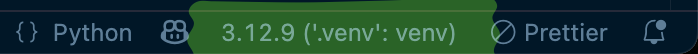
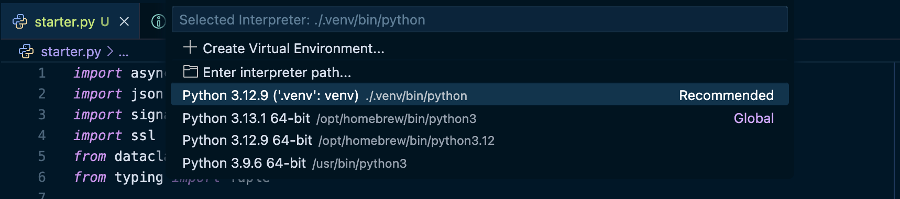

# Airwallex Transaction Detective Challenge

This project contains a Python skeleton using the `uv` package and project manager.

To get started:

1. Install `uv` using https://docs.astral.sh/uv/getting-started/installation

   - Mac users: you probably already have `brew` installed - just run `brew install uv`

2. Run `uv run starter.py` in the terminal! This will set up the Python virtual environment,
   install the libraries needed for this challenge, and start your transaction handler.

3. Configure your editor to use the virtual environment that `uv` created for you in step 2.

   - For VSCode users, open an editor tab for `starter.py`, click the Python version on the right
     side of the bottom status bar, then choose the Python interpreter located at `.venv/...`.

4. Have fun!~ Edit your Python file and restart it after you've made changes.

   - For VSCode users, you can use the Run button in the top right after doing step 3 successfully.

## Config screenshots

Status bar:

Virtual environment picker:

